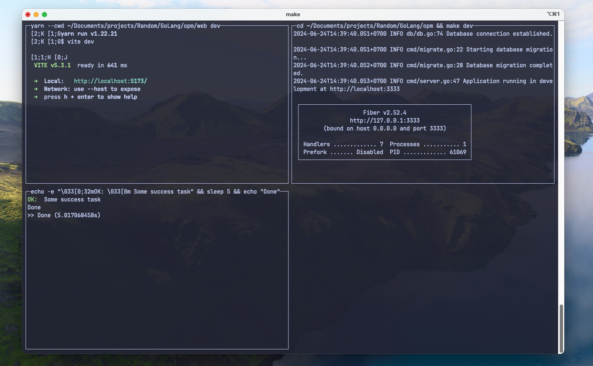

# multi-watch - Run multiple commands in their own window



Inspired by <https://github.com/cortesi/modd>

This cli allow you to run multiple commands at once, and each command will output own their own window.

For Example: when you are developing a web app using golang as backend + svelte as frontend.
You will probably like to have one window listen to the backend stuff, and one window outputing for frontend.
This cli will help you start all commands at once without the need to create seperate terminal tab, or terminal multiplexer like tmux...

## Usage

You can install the binary using:

```bash
go install github.com/luuhai48/multi-watch@latest
```

Then run it.

```bash
multi-watch \
  --cmd "go run main.go" \
  --cmd "yarn dev" \
  --cmd "echo 'hello cmd 3'"
```

Or run directly from github:

```bash
go run github.com/luuhai48/multi-watch@latest \
  --cmd "go run main.go" \
  --cmd "yarn dev" \
  --cmd "echo 'hello cmd 3'"
```

## TODOs

- [ ] Fix weird characters at start of command
- [ ] Make window scrollable
